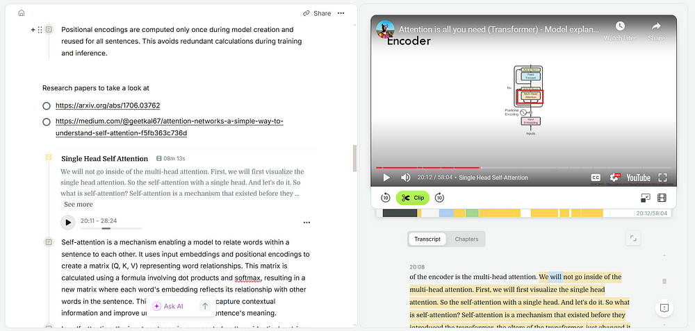
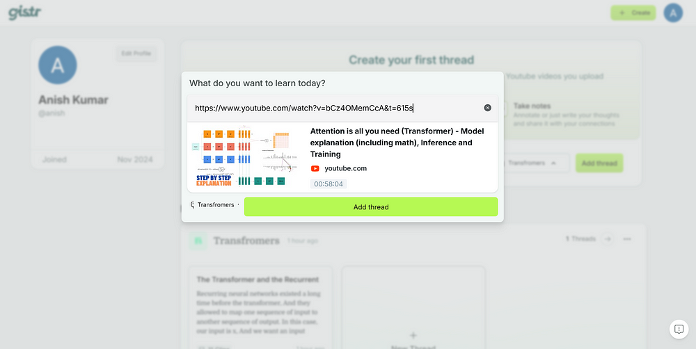
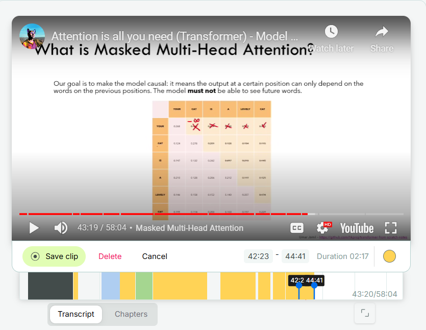
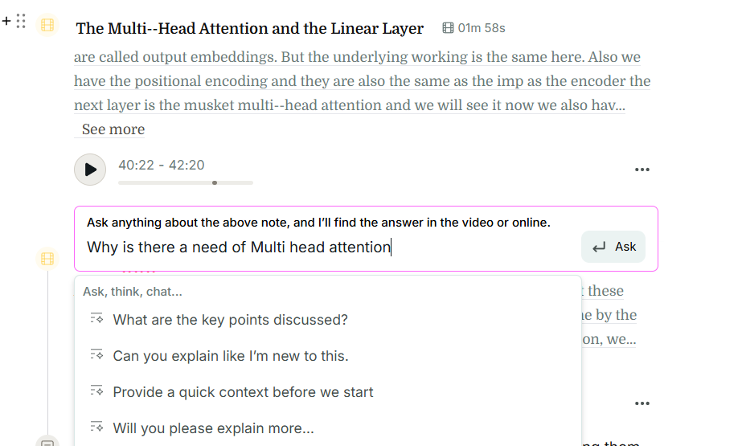
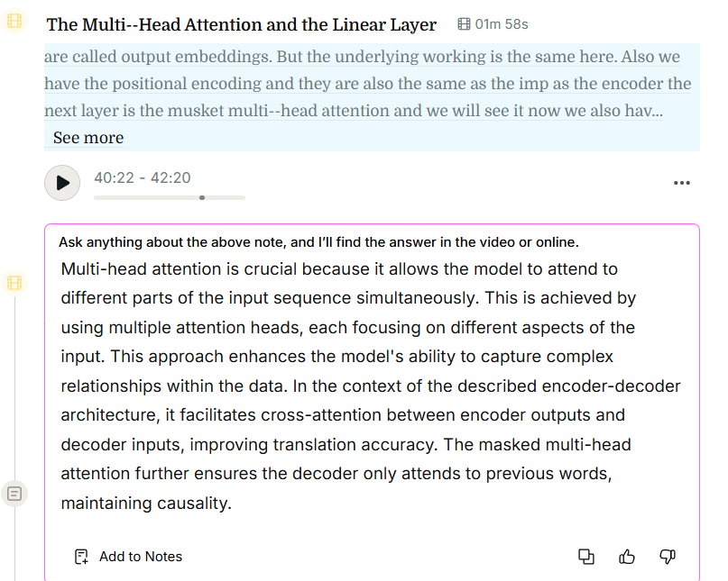
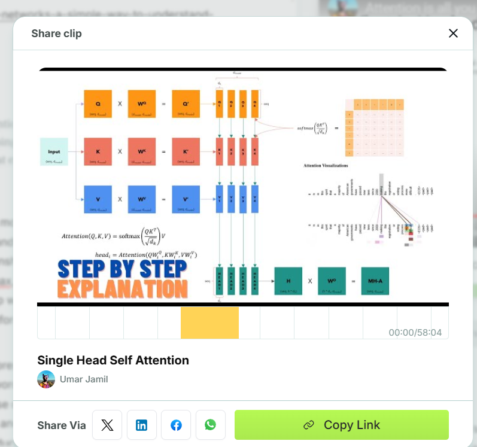

# Gistr.so
Gistr helps you turn YouTube videos into actionable insights. It highlights key moments, adds annotations, and organizes clips into collections—all in one simple tool. With AI-powered features like auto-clipping and video summaries, Gistr makes it effortless to save, revisit, and share meaningful content. It is perfect for students, professionals, researchers, and curators.

Want to see a real example?  
[Check out my curated thread here](https://gistr.so/thread/attention-is-all-you-need-transformer-model-explan).  
Or explore the platform directly: [https://gistr.so/](https://gistr.so/)

# YouTube Note-Taking in 5 Easy Steps with Gistr's Free AI-Powered Tool!

---

## Here's One Tip That No One Talks About

**Always share what you study.** Why?  
When I share my notes, the gratitude and support I get motivates me to do it again and do it better. It's a cycle that helps me:  
- Learn more,  
- Create better notes,  
- Reinforce my understanding by teaching others.  

---

## Let Me Show You My 5-Step Strategy to Take Notes Effectively with Gistr  

[Read Detailed Article Here]([https://gistr.so/](https://medium.com/@cs_nerd/master-youtube-note-taking-in-5-easy-steps-with-gistrs-free-ai-powered-tool-717d6df82c35))
---

### Step 1: Start with the Right Video  

Pick a video you want to learn from.  
On **Gistr**, we usually create a **thread** — a combo of **video, clips, and notes**. It's like:  
- Bookmarking the best parts of the video.  
- Having your notes right there for easy reference.  

It saves me from endless rewatching or hunting for that **one concept** I forgot from the video.

---

### Step 2: Highlight While Watching  

**Highlighting is where the magic begins!**  
While watching, I highlight anything that feels important. These highlights give me:  
- A quick overview of the video's main ideas.  
- Focused parts to refine later.  

By the time the video ends, I already know **which parts to focus on**, saving me hours of rewatching!

---

### Step 3: Ask Questions About Your Highlights to AI  

Here's a trick I learned the hard way: **always ask questions.**  

Before AI, asking questions meant:  
- Jumping to different sources.  
- Getting distracted.  
- Losing time.  

Now with Gistr's AI, I pause and ask:  
- **Why is this important?**  

If I don't fully grasp a concept, I ask the AI and add the explanation to my notes. This habit solidifies my understanding and ensures my notes are useful in the future.

---

### Step 4: Add Your Thoughts  

This is my favorite step!  

While AI helps with note-taking, I **always add my thoughts**:  
- Add examples.  
- Clarify points.  
- Link ideas to what I've learned before.  

Writing my thoughts makes the notes truly mine and helps me see the **bigger picture**.

---

### Step 5: Review and Refine  

Once the video is done, I take a few minutes to:  
- Remove unnecessary highlights.  
- Fill in any gaps.  
- Reflect on what I’ve learned to ensure clarity.  

By now, I’ve reviewed the content **three times**, making it stick in my memory.

---

## Bonus I Shared before.

**This step isn’t optional for me.**  

Sharing my notes:  
- Helps others.  
- Reinforces my learning.  
- Builds a supportive learning community.  

Plus, it's **fun** to see others benefit from something I’ve worked on!

---

## Why I Love Gistr  

Taking notes from videos can feel **overwhelming**. Other platforms often have too many options that discourage me.  

But **Gistr** makes it simple:  
- I focus on what matters.  
- I can revisit key moments without wasting time.  
- Sharing my notes is effortless.

---

I hope I’ve shared something valuable here. Now it's your turn to **try Gistr** and level up your learning! 🚀  

